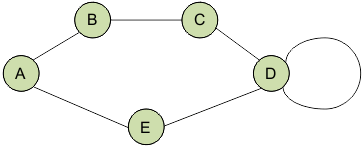
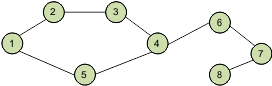
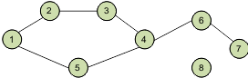
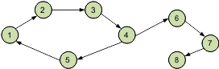
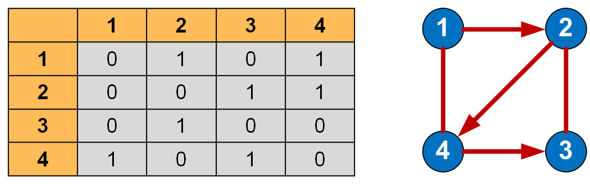
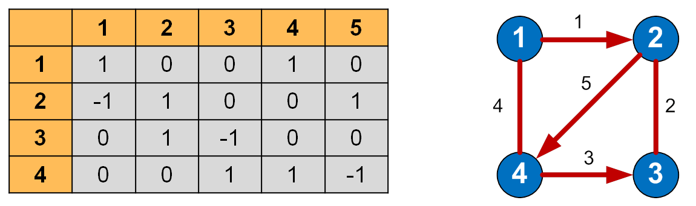
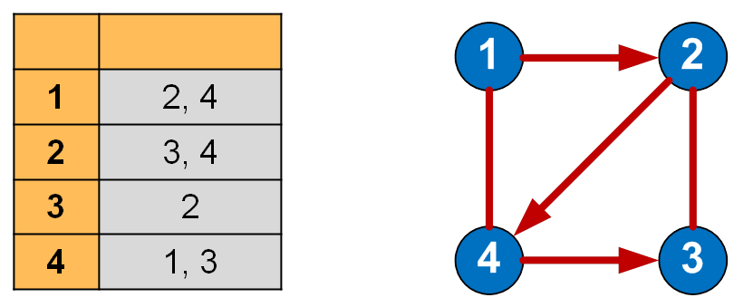
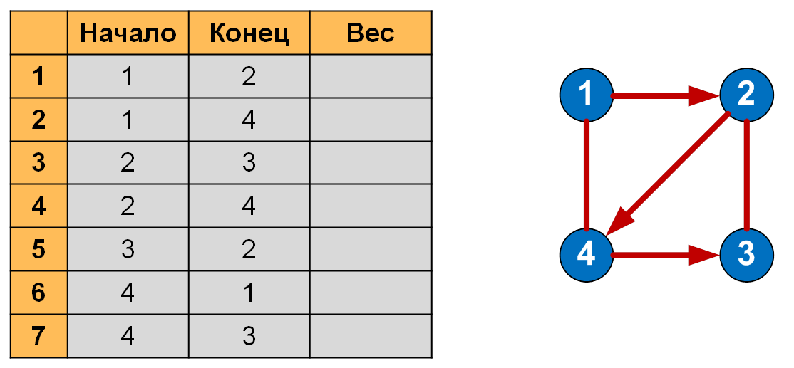

# Графовые алгоритмы. Теория

Граф – совокупность точек, соединенных линиями. Точки называются вершинами, или узлами, а линии – ребрами, или дугами.

Степень входа вершины – количество входящих в нее ребер, степень выхода – количество исходящих ребер.

Граф, содержащий ребра между всеми парами вершин, является полным.

Встречаются такие графы, ребрам которых поставлено в соответствие конкретное числовое значение, они называются взвешенными графами, а это значение – весом ребра.

Когда у ребра оба конца совпадают, т.е. оно выходит из вершины и входит в нее, то такое ребро называется петлей.




## Классификация графов

Графы делятся на

* связные



* несвязные



В связном графе между любой парой вершин существует как минимум один путь.

В несвязном графе существует хотя бы одна вершина, не связанная с другими.

Графы также подразделяются на

* ориентированные



* неориентированные


* смешанные.

В ориентированном графе ребра являются направленными, т.е. существует только одно доступное направление между двумя связными вершинами.

В неориентированном графе по каждому из ребер можно осуществлять переход в обоих направлениях.

Частный случай двух этих видов – смешанный граф. Он характерен наличием как ориентированных, так и неориентированных ребер.

## Способы представления графа

Граф может быть представлен (сохранен) несколькими способами:

* матрица смежности;
* матрица инцидентности;
* список смежности (инцидентности);
* список ребер.

Использование двух первых методов предполагает хранение графа в виде двумерного массива (матрицы). Размер массива зависит от количества вершин и/или ребер в конкретном графе.

## Матрица смежности графа

Матрица смежности графа — это квадратная матрица, в которой каждый элемент принимает одно из двух значений: 0 или 1.
Число строк матрицы смежности равно числу столбцов и соответствует количеству вершин графа.

```
0 – соответствует отсутствию ребра,
1 – соответствует наличию ребра.
```


Когда из одной вершины в другую проход свободен (имеется ребро), в ячейку заносится 1, иначе – 0. Все элементы на главной диагонали равны 0 если граф не имеет петель.

## Матрица инцидентности графа

Матрица инцидентности (инциденции) графа — это матрица, количество строк в которой соответствует числу вершин, а количество столбцов – числу рёбер. В ней указываются связи между инцидентными элементами графа (ребро(дуга) и вершина).

В неориентированном графе если вершина инцидентна ребру то соответствующий элемент равен 1, в противном случае элемент равен 0.

В ориентированном графе если ребро выходит из вершины, то соответствующий элемент равен 1, если ребро входит в вершину, то соответствующий элемент равен -1, если ребро отсутствует, то элемент равен 0.

Матрица инцидентности для своего представления требует нумерации рёбер, что не всегда удобно.



## Список смежности (инцидентности)

Если количество ребер графа по сравнению с количеством вершин невелико, то значения большинства элементов матрицы смежности будут равны 0. При этом использование данного метода нецелесообразно. Для подобных графов имеются более оптимальные способы их представления.

По отношению к памяти списки смежности менее требовательны, чем матрицы смежности. Такой список можно представить в виде таблицы, столбцов в которой – 2, а строк — не больше, чем вершин в графе.
В каждой строке в первом столбце указана вершина выхода, а во втором столбце – список вершин, в которые входят ребра из текущей вершины.




### Преимущества списка смежности:

* Рациональное использование памяти.
* Позволяет быстро перебирать соседей вершины.
* Позволяет проверять наличие ребра и удалять его.

### Недостатки списка смежности:

* При работе с насыщенными графами (с большим количеством рёбер) скорости может не хватать.
* Нет быстрого способа проверить, существует ли ребро между двумя вершинами.
* Количество вершин графа должно быть известно заранее.
* Для взвешенных графов приходится хранить список, элементы которого должны содержать два значащих поля, что усложняет код:
* * номер вершины, с которой соединяется текущая;
* * вес ребра.

## Список рёбер
В списке рёбер в каждой строке записываются две смежные вершины и вес соединяющего их ребра (для взвешенного графа).
Количество строк в списке ребер всегда должно быть равно величине, получающейся в результате сложения ориентированных рёбер с удвоенным количеством неориентированных рёбер.



Какой способ представления графа лучше? Ответ зависит от отношения между числом вершин и числом рёбер. Число ребер может быть довольно малым (такого же порядка, как и количество вершин) или довольно большим (если граф является полным). Графы с большим числом рёбер называют плотными, с малым — разреженными. Плотные графы удобнее хранить в виде матрицы смежности, разреженные — в виде списка смежности.

## Алгоритмы обхода графов

Основными алгоритмами обхода графов являются

* Поиск в ширину (bfs)
* Поиск в глубину (dfs)

## Классы ребер

* Неориентированный граф
* * древесные
* * обратные

* Ориентированный граф
* * древесные
* * обратные
* * прямые
* * перекрёстные

### Ссылки

[prog-cpp](https://prog-cpp.ru/data-graph/)
